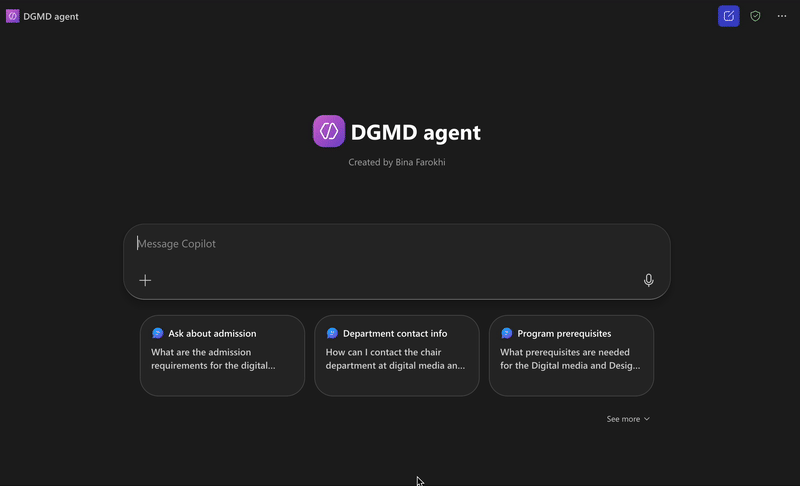

# Copilot-Agent-Langara-Digital-media-and-Design.

# Registration Copilot for Microsoft 365

This project showcases a custom **Copilot agent for registration support** built with **Microsoft Copilot Studio / Copilot for Microsoft 365**.  
The Copilot helps students and staff quickly find answers to registration questions in **one or two links**, with a **short, clear explanation**.

---

## 🎯 Problem

Students often ask the same questions about registration:
- “How do I register for the next term?”
- “Where can I see important deadlines?”
- “Who do I contact if I have a problem with registration?”

Information is spread across multiple pages and documents, and support staff spend time answering the same questions repeatedly.

---

## ✅ Solution

The **Registration Copilot** is an AI assistant that:
- Answers common registration questions using **short, friendly responses**
- Provides **1–2 direct links** to the official source (website, PDFs, forms)
- Runs inside the organization’s **Microsoft 365 environment**
- Can be added to Teams or shared as a link for students and staff

---

## 🔧 Technology & Skills

- **Microsoft Copilot Studio / Copilot for Microsoft 365**
  - Custom Copilot agent design
  - System prompts, instructions, and conversation flows
  - Grounding with organization content (SharePoint pages, documents, etc.)
- **Microsoft 365 / Power Platform**
  - Integration with **SharePoint** (registration info, FAQs, documents)
  - (Optional) Integration with **Power Automate** for actions like:
    - Logging a support request
    - Sending a follow-up email with links
- **Prompt & UX Design**
  - Short-answer style: one or two lines + 1–2 links
  - Clear tone and consistent language
  - Guardrails to avoid giving wrong or unofficial advice

---

## 🧠 How the Copilot Works

1. **User asks a question**  
   Example: “How can I register for the Winter 2026 term?”

2. **Copilot interprets the intent**
   - Detects category: *"registration process"*, *"deadlines"*, *"who to contact"*, etc.

3. **Copilot retrieves grounded information**
   - Uses connected knowledge sources (SharePoint pages, official PDFs, FAQ documents).

---

